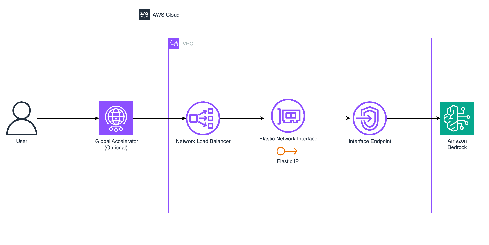

# Bedrock Accelerator CDK

This CDK project creates an infrastructure stack to accelerate Amazon Bedrock API calls by Network Load Balancer (NLB) with Elastic IP(Fixed IP). Optionally, it can be configured with AWS Global Accelerator for improved global access.

## Features

- Fixed IP address through AWS Global Accelerator
- Network Load Balancer with Elastic IP
- VPC Endpoint for Amazon Bedrock
- Automatic IP registration for VPC Endpoint
- Cross-zone load balancing enabled
- Security group with proper access controls

## Configuration

Configure the stack by editing the `.env` file in the project root:

```plaintext
# VPC Configuration
VPC_ID=vpc-xxxxxxxx
PUBLIC_SUBNET_IDS=subnet-xxxxxxxx,subnet-yyyyyyyy

# NLB Configuration
NLB_SECURITY_GROUP=0.0.0.0/0

# Global Accelerator Configuration
ENABLE_GLOBAL_ACCELERATOR=false

# AWS Region Configuration (optional)
AWS_REGION=us-east-1
```

Configuration Parameters:

| Parameter | Description | Required | Example |
|-----------|-------------|----------|---------|
| VPC_ID | ID of the VPC where resources will be created | Yes | vpc-xxxxxxxx |
| PUBLIC_SUBNET_IDS | Comma-separated list of public subnet IDs | Yes | subnet-xxx,subnet-yyy |
| NLB_SECURITY_GROUP | Restrict access to the IP range of NLB | Yes | 0.0.0.0/0 |
| ENABLE_GLOBAL_ACCELERATOR | Whether to enable Global Accelerator | No | false |
| AWS_REGION | AWS Region for deployment | No | us-east-1 |

## Deployment
1. Install dependencies:
```bash
npm install
```

2. Bootstrap CDK (if not already done):
```bash
cdk bootstrap
```

3. Deploy the stack:
```bash
npm run deploy
```

4. To destroy the stack:
```bash
npm run destroy
```

## Outputs

After deployment, the stack will output:
- NLB DNS name
- NLB Fixed IP
- (If enabled) Global Accelerator DNS name

## Troubleshooting

1. If deployment fails with VPC-related errors:
   - Verify VPC ID and subnet IDs are correct in .env file
   - Ensure subnets have proper routing and internet access

2. For Global Accelerator issues:
   - Please check the service in us-west-2 region

## Security

See [CONTRIBUTING](CONTRIBUTING.md#security-issue-notifications) for more information.

## License

This library is licensed under the MIT-0 License. See the LICENSE file.

=============================Disclaimer========================================
The sample code or script or other assets are provided as Service Content (in the case that you are using Amazon Web Services China regions) or AWS Content (in the case that you are using Amazon Web Services regions outside Mainland China) (“Assets”) under the Customer Agreement or the relevant written agreement between you and the operator of the relevant Amazon Web Services region (whichever applies). You should not use the Assets in your production accounts, or on production or other critical data. You are responsible for testing, securing, and optimizing the Assets, as appropriate for production grade use based on your specific quality control practices and standards.  Deploying the Assets may incur charges for creating or using Amazon Web Services chargeable resources, such as running Amazon EC2 instances or using Amazon S3 storage.
示例代码或脚本或其他资料（“资料”）作为您与相关亚马逊云科技区域运营商之间的客户协议或相关书面协议（以适用者为准）下的“服务内容”（如果您使用亚马逊云科技中国区域）或“AWS 内容”（如果您使用中国大陆以外的亚马逊云科技区域）而提供给您。您不应在您的生产账户中使用“资料”，也不应将“资料”用于您的生产或其他关键数据。您负责根据您的特定质量控制实践和标准对“资料”进行测试、采取安全措施和优化，以适合生产级用途。部署“资料”可能会因创建或使用亚马逊云科技收费资源（例如运行Amazon EC2 实例或使用 Amazon S3 存储）而产生费用。
=============================End of disclaimer ===================================